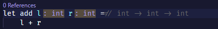
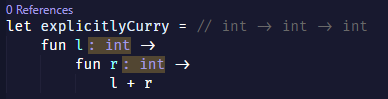
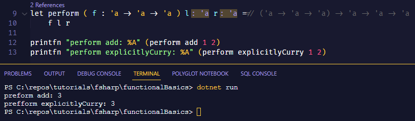
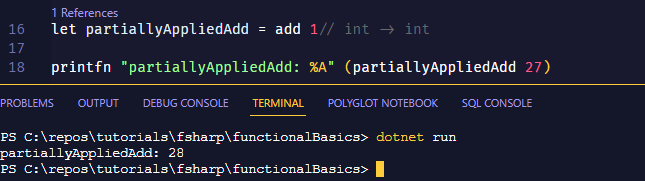
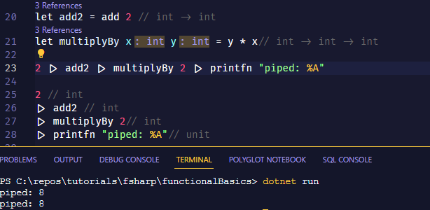
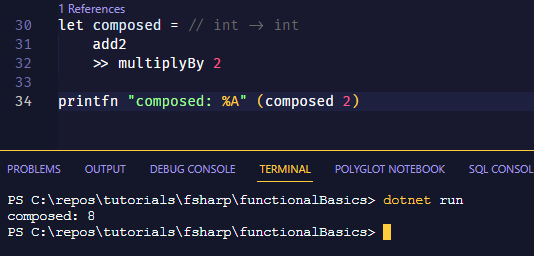
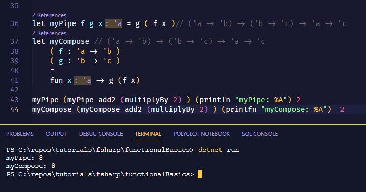

# It's Functions All the Way Down

Functional Programming is all about... well... functions! Everything is a function. Because everything is a function, there are a lot of features that make working with and manipulating functions super easy. There are actually just 3 core features to functional programming: 

- Currying
- Partial Application
- Function Composition & Piping
  
Before going into those, there's also something I'd like to clear up. I kind of glossed over in the previous tutorial that F# is an expression-based language. This is opposed to a statement-based language. Expressions are evaluations and stements are declarations. What this means in code is that there are technically no variables, just constant expressions (values) and functions. 

## An Expression Based Language

More specifically what means is this F# code:

```fsharp 
let x = 1
```
is equivalent to this JavaScript code:
```javascript
const x = () => 1;
```

Without the need to pass the [Unit type](https://learn.microsoft.com/en-us/dotnet/fsharp/language-reference/unit-type), the `()`, to the function to evaluate it. Because the expression is a constant, it only needs to be evaluated once (<span style="color:red">which happens at start up</span>) and then is bound to the name "x".

Because it's expression-based, that means the value of a `let` statement is equal to the last expression. There is no `return` keyword (at least not for this context).



You may notice a couple things here. First, there are no parentheses. In F# function arguments do not need to be tupled. Infact, if you do, it will have an effect on currying. What this is doing is defining a function named `add` which takes two arguments, `l` and `r`. If you look just to the right of the equal sign you can see some commented-out code. 
    
> I actually didn't write that, it's part of my IDE. More specifically the Ionide extension for VS Code. If you're using that, I highly recommend it as it will make your life significantly easier. I would also grab the .Net Extension Pack while you're at it too as there may be times where you have to look at some C# code (Ionide is part of the .Net Extension Pack so if you get that you don't need to install it separately).

That code is what the F# compiler is inferring as the type for that function. Other langauges may also call this the function's signature. This is a short-hand mathematical notation from [type theory](https://en.wikipedia.org/wiki/Type_theory) that will be very beneficial to get familiar with it. It's super simple, so don't worry. There's also no real "math" involved in it either.


### Type Theory Tangent

This isn't actual type theory and my word isn't gospel but I think looking at it this way gives a more intuitive understanding. I like to think of there being 4 parent types:

- And
- Or
- Value
- Mapping

*And* types are implemented as Records, Tuples, and Classes. The type has to be instantiated with all values being present.

> Don't worry so much about the syntax if it's confusing. We'll go over it more later.

```fsharp 

//record
type Customer = 
    {
        id : int
        name : string
        phone : string
    }

//tuple -- x,y coords
type Point = (int * int)

//class -- OOP class
type Animal = 
    class
    member this.Kingdom = //some logic to define that
    end
```

*Or* types are implemented as enums and unions. For enums, the type can instantiated with ***ANY*** state, meaning one or more or all states simultaneously, and unions can only be instantiated with a single state. So state a ***OR*** state B ***OR*** state etc.
```fsharp 

//enum
type Flags = 
    | First = 1
    | Second = 2
    | Third = 4

//union
type Option<'a> = // this "<'a>" is a generic type parameter.
    | Some of 'a 
    // when the value is in the "Some" state, it must be also be assigned to a value of "'a" as well. 
    // passing the Option type a type parameter is what allows the compiler to know what the type is 
    // of the internal value when type checking
    | None
```
*Value* types, or primitives, are the same as with any other language. They are what they are in a sense -- handsome is as handsome does.

```fsharp 
int 
string
float
etc.
```

*Mapping* types may be hard to get your head around. This is actually just a function. Functions, mathematically speaking, are defined as a map from some input(s) to an output.

```fsharp 
a -> b -> {...} -> z
```

The real crux of types are the underlying structure. It's a bit of an abstract concept that you'll get a feel for once we start actually experimenting with them in code.

## Back to the Expressions

What this means is: we have a constant expression; that expression evaluates to a function that takes an integer as an argument and returns a function; the function which is returned then takes *another* integer as an argument and finally evaluates to an integer. This is currying. Taking a function and it's parameter list, breaking it down to a list of functions each taking a single parameter and returning a function that takes the next parameter in the sequence.

## Currying

The syntax for a lambda (anonymous function) in F# is 

```fsharp 
fun x -> //do something
```

Notice the arrow here. We can re-write that add function to be explicit in the currying: 



As you can see, they have the same type.

```fsharp
int -> int -> int
```

Since they have the same type, they can be used interchangeably.



Note the special syntax here: 

`( f : 'a -> 'a -> 'a )`

This is how you manually assign types to expressions. Parameter `f` is defined as taking a type `'a`, that returns a function taking another `'a` which finally results in a value with the type `'a`... sound familiar? This is just a generic definition of our curried add function for ints! This means you can throw in an add function for floats, dates, records, classes, etc. As long as that function adheres to the spec of taking two of a singular type and returning that type it will work. That's the [strategy pattern](https://en.wikipedia.org/wiki/Strategy_pattern) implemented in just a single function! To do the same in a pure-OO style, you had to define an interface and/or abstract class in which multiple child classes inherit and/or implement, repsectively. This design pattern is something I use quite often and it's a really useful technique.

On to the next topic.

## Partial Application

Where currying is the breaking down of functions think of partial application as building them up.



Here, we are assigning the intermediate state of passing `1` to the `add` function and then assigning that state to the name `partiallyAppliedAdd`. Note the hinted type: `int -> int`. This is because the first parameter of the function has already been supplied and we simply only need to supply the last parameter to get the total evaluation of the function: `partiallyAppliedAdd 27`. Note that `partiallyAppliedAdd` doesn't take any parameters. This is because it's a constant expression that evaluates to `add 1`. This means that wherever you use `partiallyAppliedAdd` you can just substitue `add 1` in it's place for the same effect. Meaning, the type of the resulting evaluation is `int -> int` because that is the type of `add 1`. 

This technique is especially useful for working with a computation that needs to build up it's parameters list one-at-a-time but only needs to execute once all the arguments are supplied to it. Things like database calls, web requests, reading/writing to files... pretty much any complex IO scenarios really benefit from this approach. 

## Function Composition & Piping

If there's two things every single language would be better off with, it's an Hindley-Milner style type system and piping. Piping, like with Unix pipes, is simply wiring up the output of function `a` to function `b`.



Piping is data-centric. You're telling the compiler that the output of the left becomes the input of right; which goes into the next open parameter slot as shown by the 2nd function call in the pipe chain.

Composition is function-centric where you're telling the compiler to wire up these two functions now and that you'll supply the argments necessary for evaluation at a later time.



This is how pipe and compose are defined. I think I like the short-hand operator much better!



As you can see, the types are the same: `('a -> 'b) -> ( 'b -> 'c ) -> 'a -> 'c`. You can use the pretty interchangably and the only difference is when the argument is supplied.

## Conclusion

Well, that's it for the basics. Congratulations on being a functional programmer! Now go out and spread the word about how awesome functional programming is!
# intro-to-fp

